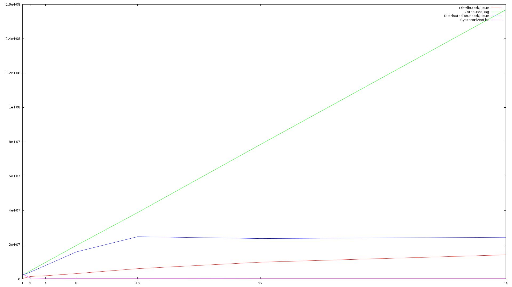
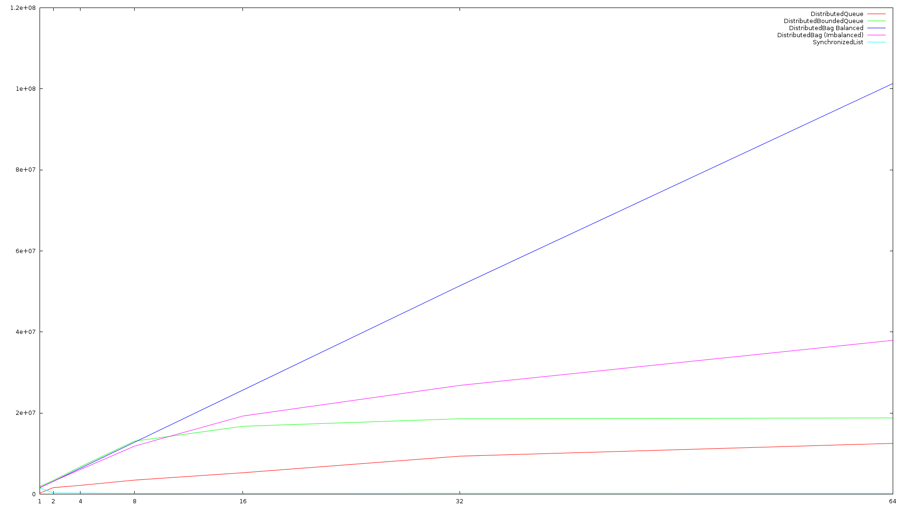

# Distributed Data Structures

This repository hosts the first framework for distributed data structures for the
Chapel programming language. Here we introduce a 'Collections' module, based on Java's
Collections framework, as well as two scalable data structures (one ordered, one unordered). 
Documentation can be seen [here](https://louisjenkinscs.github.io/Distributed-Data-Structures/).

## GSoC Information

This project was made possible through the Google Summer of Code program, who provided me an ample
stipend to live on, gave me the once-in-a-lifetime chance to design and develop new solutions in the
area of distributed computing (PGAS in particular), provided the more-than-necessary resources (Cray-XC40
cluster), and a way to learn more exciting and useful knowledge. As well, I would like to thank both of my
mentors, [**@e-kayrakli**](https://github.com/e-kayrakli) and [**@mppf**](https://github.com/mppf), who I 
have had the honor to server under. Finally, I would like to thank the Chapel project itself.

### Pull Requests & Discussions

Below I will list all Pull Requests. Not all are guaranteed to be merged at the time of this posting.

#### GlobalAtomicObject

[Discussion](https://github.com/chapel-lang/chapel/issues/6663) **(On Hold)**

[Pull Request](https://github.com/chapel-lang/chapel/pull/6717) **(Closed)**

Currently, the `GlobalAtomicObject` is an actual solution to a very big problem in distributed computing.
Atomic operations on remote memory is a very tricky topic. There are multiple approaches, but as HPC demands
high performance above all else, the number of valid choices dwindle to next to nothing. While specialized
hardware may be developed in the future, I sought to develop a software solution that works in the here-and-now.
However, to understand the actual problem, some background knowledge is required.

##### Remote Atomic Operations

As a PGAS (Partitioned Global Address Space) language, Chapel allows operations on memory to be transparent 
with respect to which node the memory is allocated on. Hence, if you can perform atomic operations on local
memory, you can make them on remote memory too. There are two ways in which these atomic operations are handled: 

1) **Remote Execution Atomic Operations**

	This is the most naive, but it is performed when nodes lack NICs like Aries which support network atomics
	at a hardware level, and is most commonly used when applications run locally. For example, imagine if the
	user were want to perform a 'wait-free' atomic operation, such as `fetchAdd` on some remote memory location.
	Without a NIC supporting network atomics, it boils down to the below...

	```chpl
	var _value : atomic int;
	on _value do _value.fetchAdd(1);
	```

	In this case, while it is technically wait-free as it is technically bounded by network latency, it must spawn 
	a remote task on the target node, and causes the current task to block until it returns. This is performed implicitly, but the performance penalty is severe enough to bottleneck any application. Furthermore, spawning a remote task deprives the target node of valuable resources, and as such results in degrading performance.

2) **Network Atomic Operations**

	This requires very specific hardware, such as the Aries NIC, which is Cray proprietary hardware and top-of-the-line.
	This is required for scalable (or even acceptable) performance for ordered data structures. Using the same example
	as before, a `fetchAdd` in this case is 'wait-free' enough to allow scalable performance. Scalable performance can
	only be achieved via an algorithm that is also bounded in terms of 'retry' operations, which rules out certain synchronization
	patterns, such as the lock-free 'CAS Retry loop' where the cost of retrying is too expensive, hence ruling out any lock-free
	algorithms and methodologies.

##### Atomic Operations on 'Wide' Pointers

As memory can be accessed transparently from the user's perspective, it must be kept track of by the runtime. Hence, to determine
which node the memory belongs to, the pointer is 'widened' into a 128-bit value which keeps track of both the memory address and
node id. The next issue is that majority of hardware do not support 128-bit network atomic operations, even the Aries NIC. With
the second approach (above) ruled out in terms of a lack of hardware support, this only allows the first approach. However, as mentioned
before, this leads to degrading performance as such is not feasible as an actual solution.

One approach to solve the problem using the second approach is to use a technique called 'pointer compression', which takes advantage of
the fact that operating systems only makes use of the first 48 bits of the virtual address space, allowing the most significant 16 bits
to store the node id. This approach works very well for clusters with less than 2^16 nodes, but is a short-term solution and not fitting
for a language that prides itself on portability. 

My approach aims to solve the problem for any number of nodes. In my solution, I used descriptors to denote objects by id, and a table
to store said objects (the descrirptor being the index into the table). This way, we may use the second approach by 
performing the atomic operations using 64-bit descriptors. This approach, while scalable, is magnitudes slower than 'pointer compression' but will work for up 2^32 nodes. Furtermore, a more practical solution, involving the Chapel runtime, is planned to
significantly improve performance.


#### Collections Module

[Discussion](https://github.com/chapel-lang/chapel/issues/6812) **Finished**

[Pull Request](https://github.com/chapel-lang/chapel/pull/7062) **Merged**

This is the initial pull request, which was officially merged to run under nightly testing.

## Performance Testing

All benchmarks performed on a Cray-XC40 cluster.

## Deque

Provides a strict ordering without sacrificing too much performance. Supports insertion
and removal from both ends, allowing FIFO, LIFO, and a Total ordering, which is
preserved across all nodes in a cluster, and employs a wait-free round-robin approach
to load distribution that ensures fairness in memory, bandwidth, and computation.

**Disclaimer:** The deque provided, while scalable, rely heavily on network atomics.
The benchmark results are produced using said network atomic operations.

## Bag

With performance that scales both in the number of nodes in a cluster and the
number of cores per node, we offer a multiset implementation, called a 'Bag',
which is a medium that allows storing and retrieving data in any arbitrary order.
This type of data structure is ideal for work queues as it employs it's own load
balancing, and offers unparalleled performance.

**Disclaimer:** A node can request a 'privatized' copy, which retrieves a clone
that is allocated on the node requesting it, reducing any excess communication.
Usage of `getPrivatizedInstance()` is highly advised for performance-critical
sections.

### Performance

We compare our data structures to a naive synchronized list implementation
as that is all that is available in the Chapel standard library.
In all cases, the data structures scale and outperform the naive implementation.

#### Insert

Implementation | Performance over Naive (at 64 nodes)
-------------- | :-----------:
SynchronizedList | 1x
DistributedDeque | 63x
DistributedBag | 403x



#### Remove

Implementation | Performance over Naive (at 64 nodes)
-------------- | :-----------:
SynchronizedList | 1x
DistributedDeque | 123x
DistributedBag | 651x


