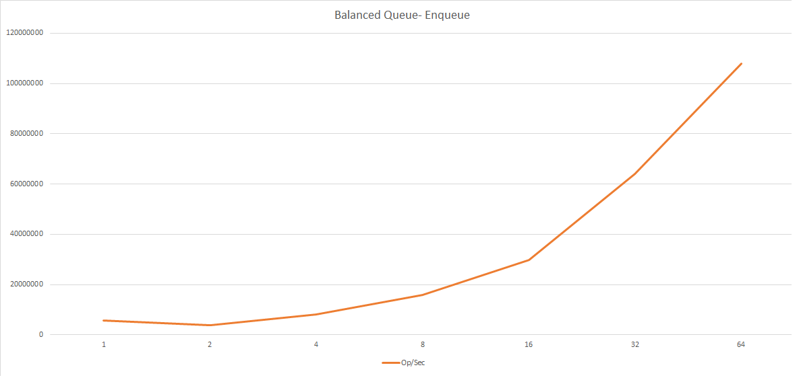
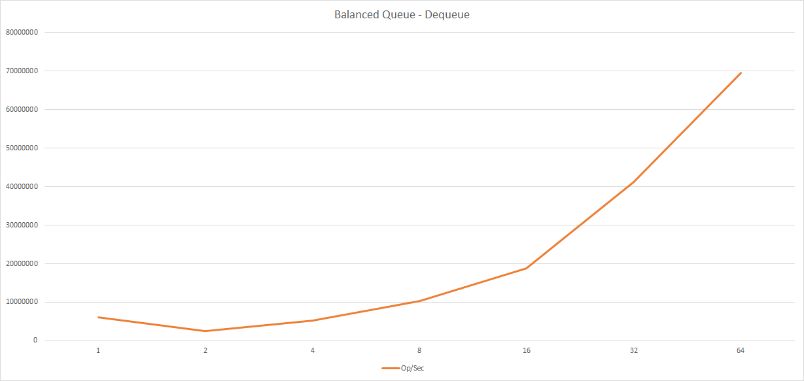

# Distributed Queue

This repository features two work-in-progress queues that scale under certain
workloads, both with varying traits and practical use-cases. One queue provides
a strict FIFO ordering across clusters (FIFO), and the other has more loose
guarantees for ordering that employs work stealing (MPMC). Neither queues are
NUMA-aware.

## Queue Descriptions

All performance testing is done on Intel Haswell architecture (w/ 24 processors per node).

## FIFO

Provides a strict FIFO ordering without sacrificing too much performance. The FIFO ordering
is preserved across all nodes in a cluster, and employs a wait-free round-robin approach
to work distribution that ensures fairness in memory, bandwidth, and computation.

### Performance

#### Enqueue

#### Dequeue

## Balanced Queue

A self-balancing queue that makes a best-effort in balancing loads across nodes in
a cluster through work stealing and other means. An ideal backbone for a work queue.
Currently the best scaling queue so far, seeing as high as 100M+ Operations/Second
at 64 nodes.

### Performance

#### Enqueue

#### Dequeue

