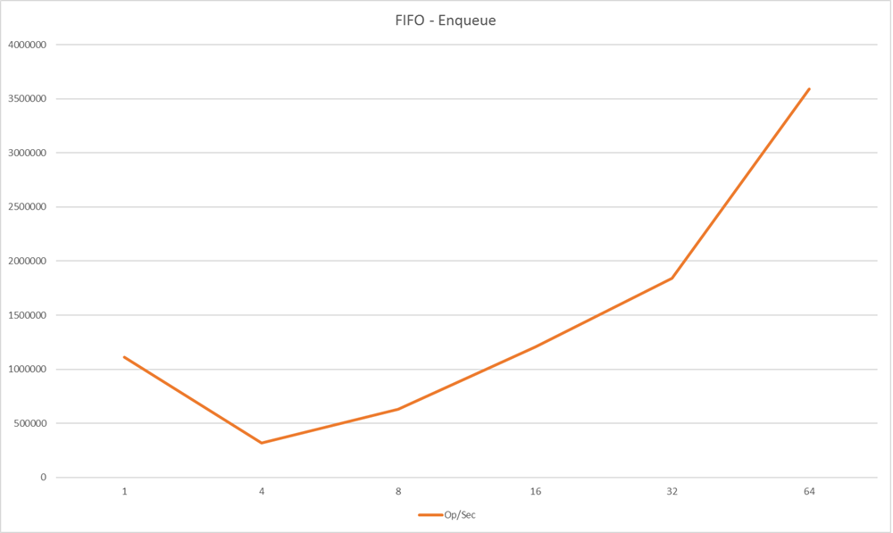
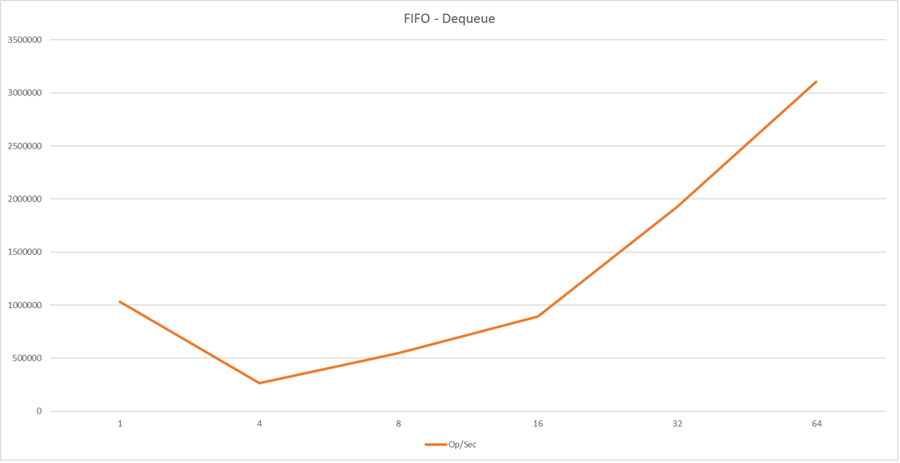
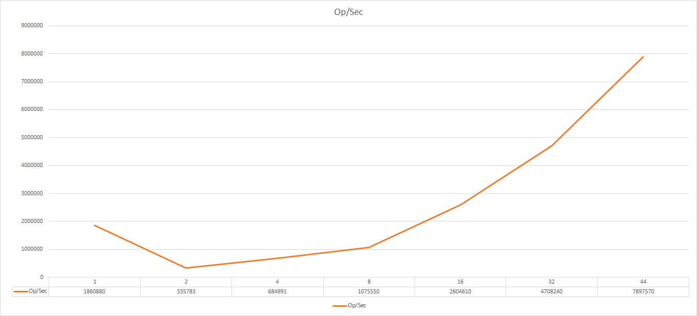

# Distributed Queue

This repository features two work-in-progress queues that scale under certain
workloads, both with varying traits and practical use-cases. One queue provides
a strict FIFO ordering across clusters (FIFO), and the other has more loose
guarantees for ordering that employs work stealing (MPMC). Neither queues are
NUMA-aware.

## Queue Descriptions

All performance testing is done on Intel Haswell architecture (w/ 24 processors per node).

## FIFO

Provides a strict FIFO ordering without sacrificing too much performance. The FIFO ordering
is preserved across all nodes in a cluster, and employs a wait-free round-robin approach
to work distribution that ensures fairness in memory, bandwidth, and computation.

### Performance

#### Enqueue

#### Dequeue

## MPMC

A queue which does not provide any FIFO ordering in favor of raw performance. An ideal
backbone for a work queue, it minimizes any and all communications and employs work stealing
to ensure work can be done, with best-effort for providing an even distribution of memory and computation.

### Features

#### Bulk Insertion and Removal (WIP)

### Performance

#### Enqueue

#### Dequeue

**Work In Progress**
