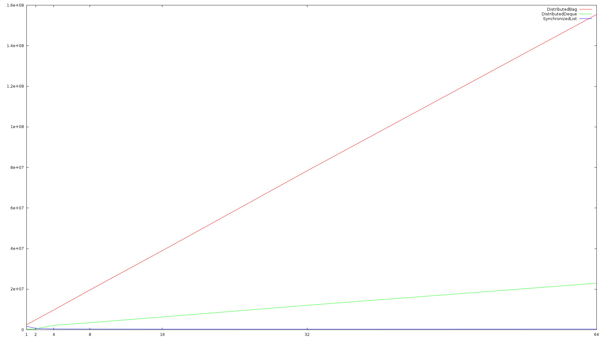
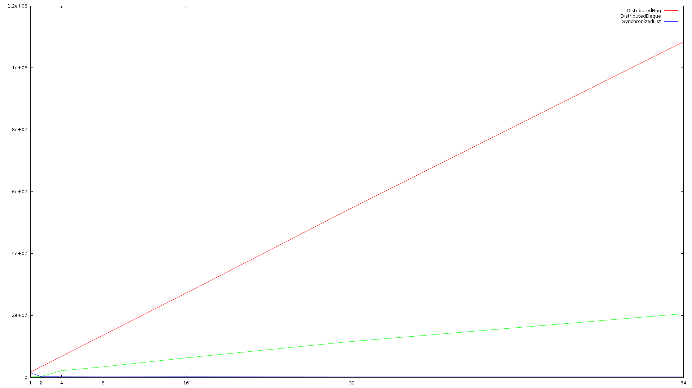

# Distributed Data Structures

This repository hosts the first framework for distributed data structures for the
Chapel programming language. Here we introduce a 'Collections' module, based on Java's
Collections framework, as well as two scalable data structures (one ordered, one unordered). 
Documentation can be seen [here](https://louisjenkinscs.github.io/Distributed-Data-Structures/).

## GSoC Information

This project was made possible through the Google Summer of Code program, who provided me an ample
stipend to live on, gave me the once-in-a-lifetime chance to design and develop new solutions in the
area of distributed computing (PGAS in particular), provided the more-than-necessary resources (Cray-XC40
cluster), and a way to learn more exciting and useful knowledge. As well, I would like to thank both of my
mentors, [**@e-kayrakli**](https://github.com/e-kayrakli) and [**@mppf**](https://github.com/mppf), who I 
have had the honor to server under. Finally, I would like to thank the Chapel project itself.

### Issues, Pull Requests & Discussions

For documentation purposes, I will list the most important information that should be taken into account for GSoC
final evaluations.

#### Issues Honorable Mentions

While I have had many issues with Chapel's compiler so far, I will only list the ones that are relatively significant.

1.	LICM (Loop-Invariant-Code-Motion), a compiler optimization, causes tuples to cause undefined behavior due to improper
	hoisting. This issue has caused me a large amount of grief and countless hours (estimated to cause me to lose a week
	of development time), and it deserves to be mentioned first. All-in-all I am glad it was caught while developing and
	not, say, for a unsuspecting user. [Link](https://github.com/chapel-lang/chapel/issues/7003).
2.	Code generation phase inaccurately performed comparison directly on references. In the compiler, references are actually
	pointers, and so during comparison it would compare it by pointer to something else. Now if you were to perform this
	comparison, it could lead to code inaccurately taking branches of code it was not meant to. This only caused me to lose
	a day. [Link](https://github.com/chapel-lang/chapel/pull/7065).
3.	Returning a tuple from an overloaded method, which would result in dynamically dispatching the method at runtime, would
	cause the compiler to crash if not captured at the callsite. This is no normal internal error, where you get a decent 
	error message and a line number, this resulted in an actual segmentation fault during compilation. Currently, this bug 
	is still not patched and a careless user can trigger it by not capturing the return value of `remove`. This caused me
	to lose a weekend of development time. [Link](https://github.com/chapel-lang/chapel/issues/6542).

#### GlobalAtomicObject - Spin-Off Project

A spin-off project that was created from the desire to solve a core problem to creating scalable data structures:
performing atomic operations on class instances. It has played an important role in experimentation, and it would
be invaluable as a tool to create more scalable distributed data structures, and is useful even for any arbitrary
application. This sub-project could not be completed as it would require some Chapel runtime and compiler changes
to make it work more efficiently, but even now it proves to be a scalable solution, and as such deserves to be
mentioned here. There will be more improvements made on this, as it will become my next (unfortunately non-funded)
project, as it will be another first and novel solution.

[Discussion](https://github.com/chapel-lang/chapel/issues/6663) - Is currently on hold as the GSoC project is unfinished
and is over larger priority.

[Pull Request](https://github.com/chapel-lang/chapel/pull/6717) - Currently is closed as this requires a lot more work.

[Repository](https://github.com/LouisJenkinsCS/Chapel-Atomic-Objects) - It has been moved to its own repository and stripped
from this project.

#### Collections Module

The 'Collections' module is an attempt to bring Java-like data structures to distributed computing. Prior to this module, the
only available data structure was the `List`, a singly-linked list that offered no parallel-safety nor took advantage of distributing
memory across nodes. The pattern before Collection was to create your own distributed data structures, specific to your own needs.
While this makes sense for raw performance, the core focus of Chapel is to bring abstraction and make it easier to make distributed
data structures; tie on the fact that, while I'm not trying to exaggerate my achievements but, making distributed data structures is
hard. With abstraction comes a lack of control, as many fine-grained communications are made implicitly betwen nodes without realizing,
easily degrading performance when not needed. Developing these data structures is also time consuming, and developing them each time will
detract from the time needed to create appplication software.

Not only have I created two excellent data structures, they both make use of low-level techniques that the user should avoid, such as
privatization (allocating a clone on each node that is used to prevent excess implicit communications caused by accessing class fields).
Furthermore, not only do my data structures perform well, they are also very useful, as they offer abstractions people may commonly
require, such as iteration, reductions, utility methods, etc. Lastly, the Collections module offers something that was also lacking: an
interface. Currently Chapel does not support interfaces ([yet...](https://github.com/chapel-lang/chapel/blob/master/doc/rst/developer/chips/2.rst#interface-declarations)), and this will be the first. We provide a contract between the user and developer that a certain
object will support insertion, removal, and iteration, with lookup, bulk insertion, and bulk removal being added for 'free'. This allows
the user to reliably use any Collection, and it allows developers who do not to implement specialized versions of the 'for free' methods.

[Discussion](https://github.com/chapel-lang/chapel/issues/6812) - The original discussions for the Collections module.

[Pull Request](https://github.com/chapel-lang/chapel/pull/7062) - The initial PR that was merged upstream. Needed to perform nightly
testing.

## Performance Testing

All benchmarks performed on a Cray-XC40 cluster, at 64-nodes, with Intel Broadwell processors.

## Deque

Provides a strict ordering without sacrificing too much performance. Supports insertion
and removal from both ends, allowing FIFO, LIFO, and a Total ordering, which is
preserved across all nodes in a cluster, and employs a wait-free round-robin approach
to load distribution that ensures fairness in memory, bandwidth, and computation.

**Disclaimer:** The deque provided, while scalable, rely heavily on network atomics.
The benchmark results are produced using said network atomic operations.

## Bag

With performance that scales both in the number of nodes in a cluster and the
number of cores per node, we offer a multiset implementation, called a 'Bag',
which is a medium that allows storing and retrieving data in any arbitrary order.
This type of data structure is ideal for work queues as it employs it's own load
balancing, and offers unparalleled performance.

### Performance

We compare our data structures to a naive synchronized list implementation
as that is all that is available in the Chapel standard library.
In all cases, the data structures scale and outperform the naive implementation.

#### Insert

Implementation | Performance over Naive (at 64 nodes)
-------------- | :-----------:
SynchronizedList | 1x
DistributedDeque | 63x
DistributedBag | 403x

#### Remove

Implementation | Performance over Naive (at 64 nodes)
-------------- | :-----------:
SynchronizedList | 1x
DistributedDeque | 123x
DistributedBag | 651x

