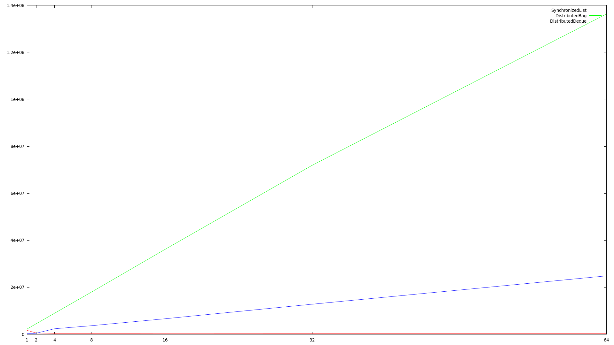

# Distributed Data Structures

This repository hosts the first framework for distributed data structures for the
Chapel programming language. Here we introduce a 'Collections' module, based on Java's
Collections framework, as well as two scalable data structures (one ordered, one unordered). 
Documentation can be seen [here](https://louisjenkinscs.github.io/Distributed-Data-Structures/).

## GSoC Information

This project was made possible through the Google Summer of Code program, who provided me an ample
stipend to live on, gave me the once-in-a-lifetime chance to design and develop new solutions in the
area of distributed computing (PGAS in particular), provided the more-than-necessary resources (Cray-XC40
cluster), and a way to learn more exciting and useful knowledge. As well, I would like to thank both of my
mentors, @e-kayrakli and @mppf, who I have had the honor to server under. Finally, I would like to thank
the Chapel project itself.

### Pull Requests & Discussions

Below I will list all Pull Requests. Not all are guaranteed to be merged at the time of this posting.

#### GlobalAtomicObject

Currently, the `GlobalAtomicObject` is an actual solution to a very big problem in distributed computing.
Atomic operations on remote memory is a very tricky topic, as currently in Chapel there are two approaches:

1) Remote Execution Atomic Operations

	This is the most naive, but it is performed when nodes lack NICs like Aries which support network atomics
	at a hardware level, and is most commonly used when applications run locally. For example, imagine if the
	user were want to perform a 'wait-free' atomic operation, such as `fetchAdd` on some remote memory location.
	Without a NIC supporting network atomics, it boils down to the below...

	```chpl
	var _value : atomic int;
	on _value do _value.fetchAdd(1);
	```

	In this case, this is no longer wait-free as it spawns a remote task on the target node, and causes the current
	task to block until it returns. This is performed implicitly, but the performance penalty is severe enough to
	bottleneck any application. Furthermore, spawning a remote task deprives the target node of valuable resources,
	and as such results in degrading performance.
	
2) Network Atomic Operations

#### Collections Module - Initial

This is the initial pull request, which was officially merged to run under nightly testing.

## Performance Testing

All benchmarks performed on a Cray-XC40 cluster.

## Deque

Provides a strict ordering without sacrificing too much performance. Supports insertion
and removal from both ends, allowing FIFO, LIFO, and a Total ordering, which is
preserved across all nodes in a cluster, and employs a wait-free round-robin approach
to load distribution that ensures fairness in memory, bandwidth, and computation.

**Disclaimer:** The deque provided, while scalable, rely heavily on network atomics.
The benchmark results are produced using said network atomic operations.

## Bag

With performance that scales both in the number of nodes in a cluster and the
number of cores per node, we offer a multiset implementation, called a 'Bag',
which is a medium that allows storing and retrieving data in any arbitrary order.
This type of data structure is ideal for work queues as it employs it's own load
balancing, and offers unparalleled performance.

**Disclaimer:** A node can request a 'privatized' copy, which retrieves a clone
that is allocated on the node requesting it, reducing any excess communication.
Usage of `getPrivatizedInstance()` is highly advised for performance-critical
sections.

### Performance

We compare our data structures to a naive synchronized list implementation
as that is all that is available in the Chapel standard library.
In all cases, the data structures scale and outperform the naive implementation.

#### Insert

Implementation | Performance over Naive (at 64 nodes)
-------------- | :-----------:
SynchronizedList | 1x
DistributedDeque | 63x
DistributedBag | 403x



#### Remove

Implementation | Performance over Naive (at 64 nodes)
-------------- | :-----------:
SynchronizedList | 1x
DistributedDeque | 123x
DistributedBag | 651x


